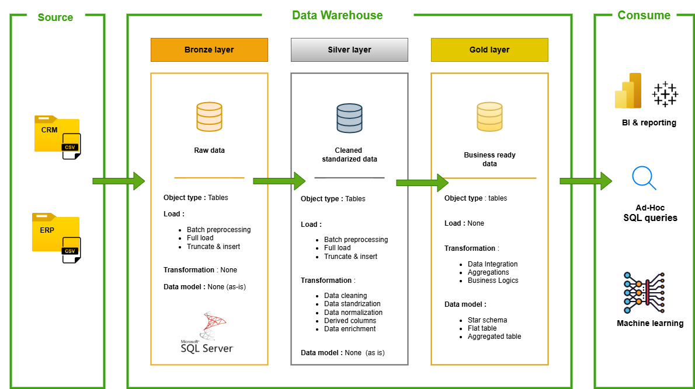

# SQL Data Warehouse and Analytics project 

Welcome to my SQL Data Warehouse & Analytics Project! 🚀

This repository showcases a complete data engineering workflow from designing and building a robust data warehouse to performing insightful analytics.

Developed as part of my learning, this project reflects industry-aligned practices in **data modeling**, **ETL processes**, and **SQL-based analytics**, offering a hands-on demonstration of how raw data can be transformed into valuable business intelligence.

---
## 🔍 Project overview : 

---

## 🛠️ Project requirements : 

---

## 🏗️ Data Architecture :

---

## 📂 Repository structure : 

---

## 🛡️ License :
This project is licensed under the [MIT License](LICENSE). You are free to use, modify, and share this project with proper attribution.

